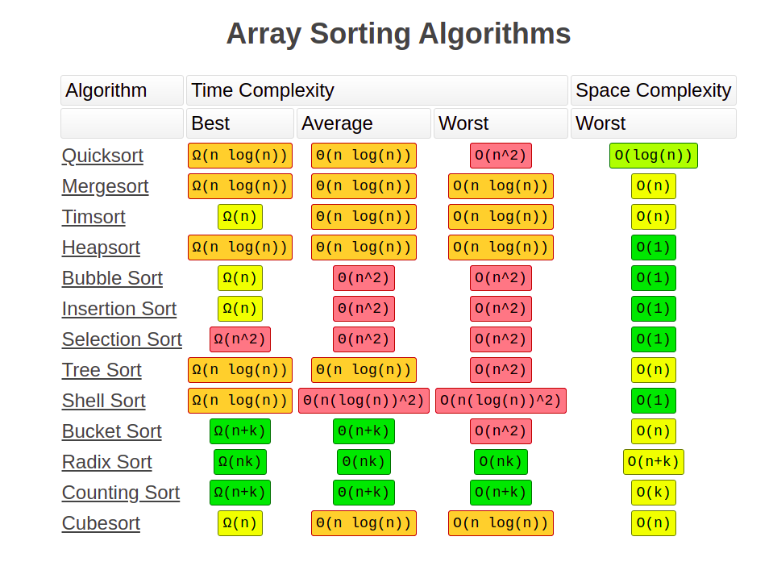

# Algorithms

Given a problem:
- Read the statement thoroughly
- Ask for examples minimum of 3 if not given, makes life much easier
- Go through the examples and understand the input, outputs and constraints
- Figure out what happens in the initial condition and at the end of the given problem
- Check for any corner cases like empty inputs or invalide inputs
- Write a pseudo code and iterate the given inputs and figure what what happens with the logic you have thought off and improve it
- Once all the examples are covered, convert the pseudo code to a language of your preferences 
- ASk what is acceptable and what not is
    - Eg: integer reverse can be done pretty easy once we convert it into python string
    ```
    class Solution(object):
    def reverse(self, x):
        """
        :type x: int
        :rtype: int
        """
        m = 1
        if x < 0:
            m = -1
            x *= m
        s = str(x)[::-1]
        n = int(s)
        if n > pow(2, 31):
            return 0
        return  n * m 
    ```


## Types   
- Dynamic Programming
- Recursion and Backtracking
- Divide and Conquer

## Problems
- LRU Cache implementation : https://www.geeksforgeeks.org/lru-cache-implementation/
