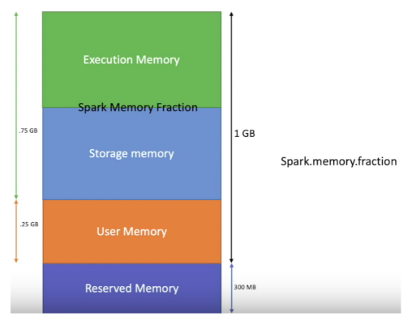

# Apache Spark

- Spark Jargons : https://mageswaran1989.medium.com/spark-jargon-for-starters-af1fd8117ada
- RDD basics: http://homepage.cs.latrobe.edu.au/zhe/ZhenHeSparkRDDAPIExamples.html
- Check here for SQL reference: https://spark.apache.org/docs/latest/api/sql/index.html
- What is Spark Job, Stage, Tasks?
- What is an executor? What are executor cores ? How tasks are scheduled to the executor?
- Dataset APIs Intro : https://medium.com/swlh/spark-dataset-apis-a-gentle-introduction-108cdeafdea5
- Can you explain how RDD sorting works in Apache Spark? How different it is from traditional in-memory sort?
- What are types of joins available in Spark?
    - Sort Merge Join
    - Broadcast hash join
    - Hash join
- What is Sort merge join?
- What is Data Skew? And how to find it ? how to avoid it?
    - Make sure the data doesn’t have duplicates
    - No null values on joining column (https://blog.clairvoyantsoft.com/optimize-the-skew-in-spark-e523c6ee18ac)  
    - When joining a small table with a very big table, what care should be taken? How does the partition of tables should be handled?
    - Key salting (https://itnext.io/handling-data-skew-in-apache-spark-9f56343e58e8)
- Transformations and Actions in Spark - https://training.databricks.com/visualapi.pdf
- Catalyst optimizer and project tungsten Ref -> https://www.linkedin.com/pulse/catalyst-tungsten-apache-sparks-speeding-engine-deepak-rajak/?trackingId=Yj2yG1e570tjYD21sR0O9g%3D%3D
- What is partitioning in Spark?
    - https://kontext.tech/column/spark/296/data-partitioning-in-spark-pyspark-in-depth-walkthrough
    - Data is split into chunks. Chunks are defined by file size or number of records or key used fo the split 
    - HDFS vs S3 partitioning : While HDFS has its own partition size config defaults to 128MB, AWS S3 depends on the size of the partition defined in the config
    - TODO config params?
    - Shuffle partition : Number of partitions created while doing shuffle exchanges. Default is 200 (spark.sql.shuffle.partition)
    - Range Partition
    - Hash partition
    - RDD -> `spark.default.parallelism` and DataFrame -> `spark.sql.shuffle.partitions` 
- What is the difference between Spark partition vs Hive partition?
    - While Spark partition is done to chunk the data for processing by Spark executors, Hive partition is for hierarchical storage of data based on column for fast analysis
- What is the predictor push down?
    - While scanning parquet files, it's best to filter out the columns that are not needed and keep only the ones needed for the query. I.e “filter early and often”
- How Spark engine makes the job run faster?
    - More number of Map jobs
    - Less Disk I/O
- How Executor memory is managed in Spark ?
    - https://spark.apache.org/docs/latest/configuration.html#memory-management
    - 1.3GB : Input Spark Executor memory
    - 300 MB : Reserved Memory
    - 25 % of (1.3GB - 300MB) = 250MB User memory : To store data objects and data structures 
    - 75% of of (1.3GB - 300MB) = 750MB Spark Memory Fraction
        - Storage Memory : Cache memory
        - Execution Memory: Temp memory Eg. Aggregation results
            
            
    - Yarn Memory Overhead : 10% of Executor memory `spark.yarn.executor.memoryOverhead`
    - YM is used to store the runtime class objects and strings
    - High Concurrency
    - When number of cores are greater than 5, the meta data handling will shoot up leaving no memory while processing the data
    - Executor getting Big Partitions due to data skew, which then takes lot of time to process or caching can go wrong
    - There are situations where each of the above pools of memory, namely execution and storage, may borrow from each other if the other pool is free. Also, storage memory can be evicted to a limit if it has borrowed memory from execution. However, without going into those complexities, we can configure our program such that our cached data which fits in storage memory should not cause a problem for execution.
    - If we don’t want all our cached data to sit in memory, then we can configure “spark.memory.storageFraction” to a lower value so that extra data would get evicted and execution would not face memory pressure. 
- How do you optimize a job?
    - Check the input data size and output data size and correlate to operating  cluster memory and adjust the memory accordingly
    - Check Input partition size, output partition size and number of partitions along with shuffle partition and decide number of cores
    - Check for disk memory spills during stage execution to see for memory issues
    - Check number of executors used for given cluster size, and optimize accordingly
    - Available cluster memory and memory in use by the application/job
    - Check average run time of all stages in the job, and try to identify any of the stages that takes lot of time to execute compared others, which can lead to data skew
    - Check whether the table is partitioned by column or not (bucketing)?
- What happens when a dataframe is partitioned by primary column or bucket on primary column? Is it a valid approach? Or how to partition a DF where all the columns are having high cardinality?
- How to avoid Spark from creating a large number of small files? https://medium.com/airbnb-engineering/on-spark-hive-and-small-files-an-in-depth-look-at-spark-partitioning-strategies-a9a364f908
- What is a physical plan and logical plan?
    - df.explain()
    - Exchange are the shuffle tasks
    ```
        t1 = spark.table('unbucketed1')
        t2 = spark.table('unbucketed2')
        
        t1.join(t2, 'key').explain()
        
        #----------------------------------------------------
        == Physical Plan ==                                                             
        *(5) Project [key#10L, value#11, value#15]
        +- *(5) SortMergeJoin [key#10L], [key#14L], Inner
        :- *(2) Sort [key#10L ASC NULLS FIRST], false, 0
        :  +- Exchange hashpartitioning(key#10L, 200)
        :     +- *(1) Project [key#10L, value#11]
        :        +- *(1) Filter isnotnull(key#10L)
        :           +- *(1) FileScan parquet default.unbucketed1[key#10L,value#11] Batched: true, Format: Parquet, Location: InMemoryFileIndex[file:/opt/spark/spark-warehouse/unbucketed1], PartitionFilters: [], PushedFilters: [IsNotNull(key)], ReadSchema: struct<key:bigint,value:double>
        +- *(4) Sort [key#14L ASC NULLS FIRST], false, 0
          +- Exchange hashpartitioning(key#14L, 200)
             +- *(3) Project [key#14L, value#15]
                +- *(3) Filter isnotnull(key#14L)
                   +- *(3) FileScan parquet default.unbucketed2[key#14L,value#15] Batched: true, Format: Parquet, Location: InMemoryFileIndex[file:/opt/spark/spark-warehouse/unbucketed2], PartitionFilters: [], PushedFilters: [IsNotNull(key)], ReadSchema: struct<key:bigint,value:double>, SelectedBucketsCount: 16 out of 16
    ```
- How do you schedule Spark jobs?
    - Airflow DAGs
    - AWS ?
- What is the difference between == and === ?
    - == returns a boolean
    - === returns a column (which contains the result of the comparisons of the elements of two columns)
    - https://stackoverflow.com/questions/39490236/difference-between-and-in-scala-spark
- What does trigger Spark OOM ?
    - Driver OOM : collect() & broadcast()
      - Collect operation
      - Broadcast join: When drivers tries to read the entire table on to driver and broadcast to the cluster
    - Executor OOM 
    - Incorrect usage of Spark
    - High concurrency
        - Each task read takes 128MB data for each HDFS parition 
    - Inefficient queries
    - Incorrect configuration
    - External shuffle service on node manager
- What is the difference between partitioning and bucketing ?
    - Both helps in filtering the data while reading by scanning only the necessary files for downstream SQL tasks
    - Partitioningby column is good but multi level partitioning will lead to many small files on cardinal columns
    - Bucketing on cardinal columns will allows as to split the data to specified number of buckets
    - With bucket we can specify the number of buckets we needed
    - For each partition there will specified number buckets i.e Number of partition * Number of Buckets
    - Number of buckets = Size of data / 128MB
    - Config: spark.sql.sources.bucketing.enabled
    ```
        df.write\
        .bucketBy(16, 'key') \
        .sortBy('value') \
        .saveAsTable('bucketed', format='parquet')
        
        t2 = spark.table('bucketed')
        t3 = spark.table('bucketed')
        
        # bucketed - bucketed join. 
        # Both sides have the same bucketing, and no shuffles are needed.
        t3.join(t2, 'key').explain()
        
        #----------------------------------------------------------------------
        == Physical Plan ==
        *(3) Project [key#14L, value#15, value#30]
        +- *(3) SortMergeJoin [key#14L], [key#29L], Inner
        :- *(1) Sort [key#14L ASC NULLS FIRST], false, 0
        :  +- *(1) Project [key#14L, value#15]
        :     +- *(1) Filter isnotnull(key#14L)
        :        +- *(1) FileScan parquet default.bucketed[key#14L,value#15] Batched: true, Format: Parquet, Location: InMemoryFileIndex[file:/opt/spark/spark-warehouse/bucketed], PartitionFilters: [], PushedFilters: [IsNotNull(key)], ReadSchema: struct<key:bigint,value:double>, SelectedBucketsCount: 16 out of 16
        +- *(2) Sort [key#29L ASC NULLS FIRST], false, 0
          +- *(2) Project [key#29L, value#30]
             +- *(2) Filter isnotnull(key#29L)
                +- *(2) FileScan parquet default.bucketed[key#29L,value#30] Batched: true, Format: Parquet, Location: InMemoryFileIndex[file:/opt/spark-warehouse/bucketed], PartitionFilters: [], PushedFilters: [IsNotNull(key)], ReadSchema: struct<key:bigint,value:double>, SelectedBucketsCount: 16 out of 16

    ```
- How coalesce works internally? How is it able to reduce 100 partitions to 10? Whats the down side of it?
- Custom partitioning with a user defined partitioner?
- what happens if one of the node where data cached goes down ?
    - Depends on the data dependency, if one to one relation then one of other nodes can recalculate the missing data part
    - If one to all dependency encountered, then as per Spark data redundancy policy the the whole stage will be re computed
- When reducebyKey is better than groupByKey then what's the use of GroupByKey?
    - In groupByKey the values are grouped but not reduced i.e no operation done on the grouped data
    - Whereas in reduceBy, the data is grouped locally, merged locally and then with other partitions 
- Window function
    ```
        window_spec = Window.partitionBy('department').orderBy('salary')
        
        from pyspark.sql.functions import row_number
        df.withColumn("row_number", row_number().over(window_spec)).show()
        
        from pyspark.sql.functions import rank
        df.withColumn("rank", rank().over(window_spec)).show()
   ```

    ```
        window_spec_agg  = Window.partitionBy("department")
        df.withColumn("row",row_number().over(window_spec)) \
        .withColumn("avg", F.avg(F.col("salary")).over(window_spec_agg)) \
        .withColumn("sum", F.sum(F.col("salary")).over(window_spec_agg)) \
        .withColumn("min", F.min(F.col("salary")).over(window_spec_agg)) \
        .withColumn("max", F.max(F.col("salary")).over(window_spec_agg)) \
        .show()
  ```
- Broadcast
  ```
   words_new = sc.broadcast(["scala", "java", "hadoop", "spark", "akka"])
   data = words_new.value
   ```
- Accumulator
  ```
  num = sc.accumulator(0) 
  ```
- Common symptoms of excessive GC in Spark are:
    - Slowness of application
    - Executor heartbeat timeout
    - GC overhead limit exceeded error
- Storing data off-heap: Be careful when using off-heap storage as it does not impact on-heap memory size i.e. 
  it won’t shrink heap memory. So to define an overall memory limit, assign a smaller heap size.
    – `conf spark.memory.offHeap.enabled = true`
    – `conf spark.memory.offHeap.size = Xgb`
- The SORT BY clause is used to return the result rows sorted within each partition in the user specified order. 
  When there is more than one partition SORT BY may return result that is partially ordered.
  Reference :https://spark.apache.org/docs/latest/sql-ref-syntax-qry-select-sortby.html
  The ORDER BY clause is used to return the result rows in a sorted manner in the user specified order. 
  Unlike the SORT BY clause, this clause guarantees a total order in the output.
  Reference : https://spark.apache.org/docs/latest/sql-ref-syntax-qry-select-orderby.html

## Use cases
- https://stackoverflow.com/questions/32887595/how-does-spark-achieve-sort-order 
- https://stackoverflow.com/questions/33878370/how-to-select-the-first-row-of-each-group?rq=1
- Forward fill @ 
  https://johnpaton.net/posts/forward-fill-spark/
  https://www.jitsejan.com/forward-filling-in-spark.html
- https://medium.com/agile-lab-engineering/how-to-create-an-apache-spark-3-0-development-cluster-on-a-single-machine-using-docker-964478c3735b


    
