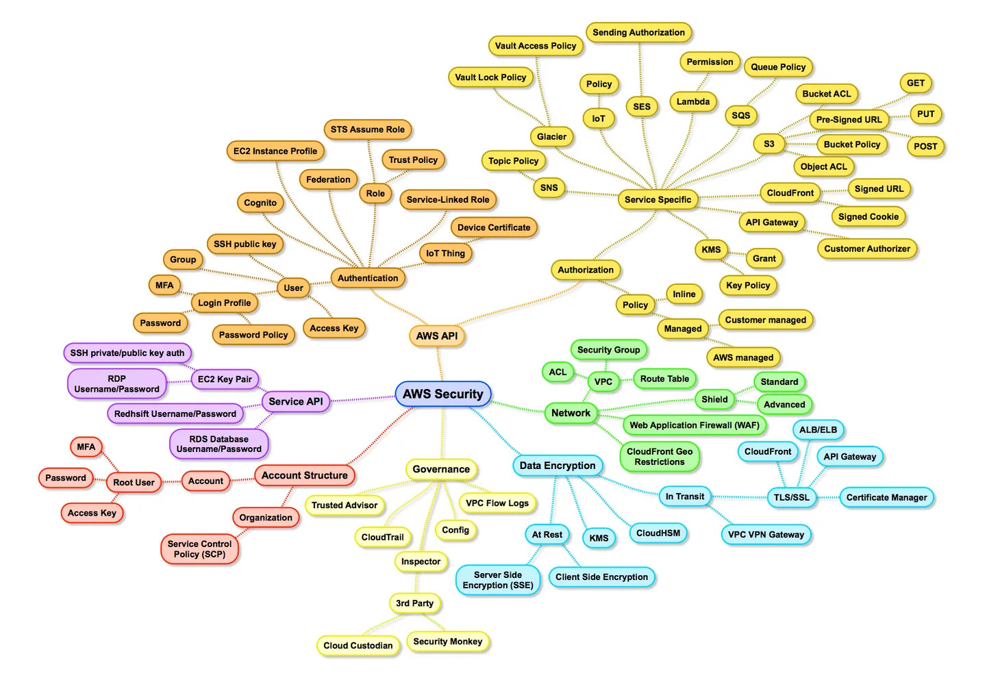
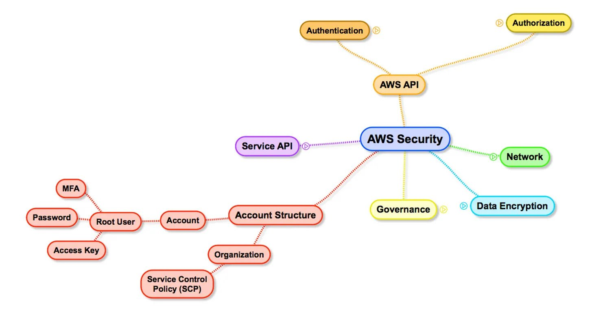
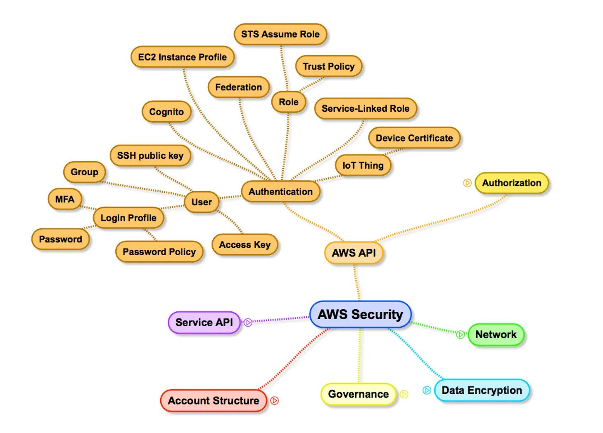
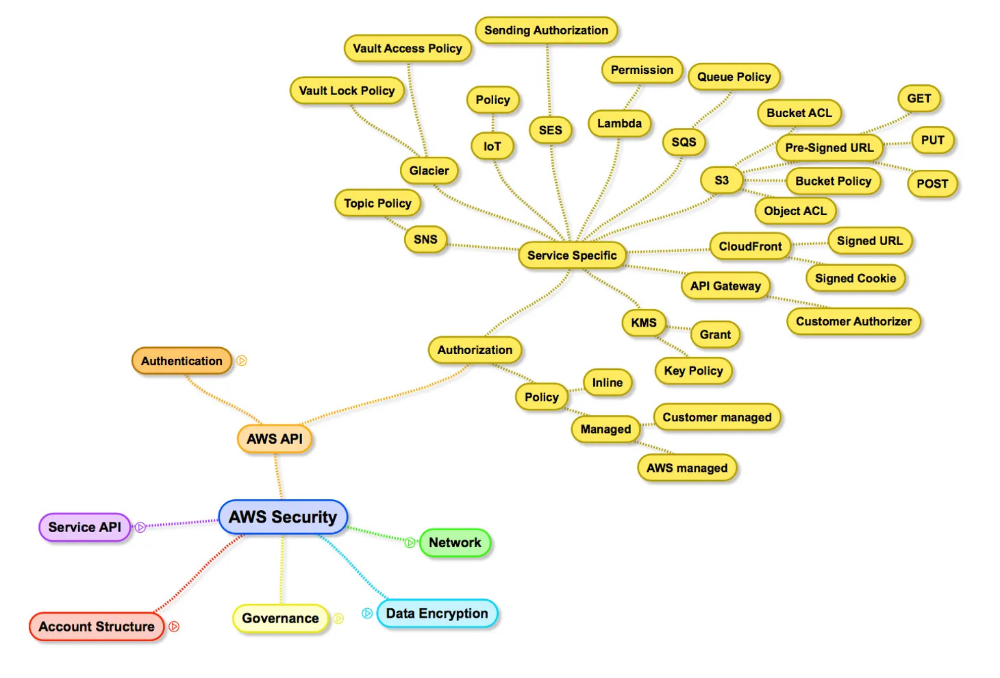
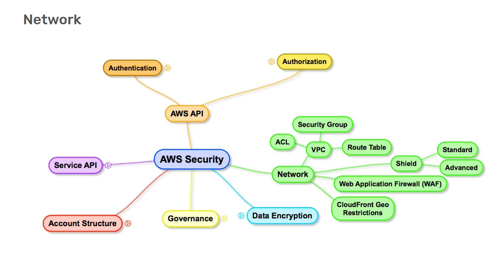
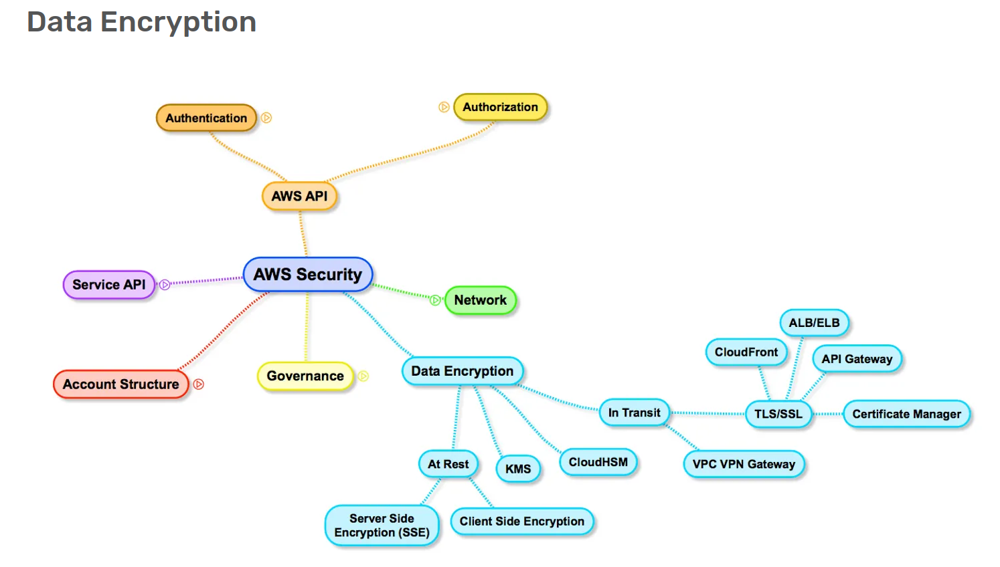

# AWS

- [ML Map](https://gitlab.com/juliensimon/awsmlmap)
- [AWS Lambda Inference](https://www.youtube.com/watch?v=uMEqCsuh9Gs)
- [AWS Security Primer](https://cloudonaut.io/aws-security-primer/)
    - 
    - 
    - 
    - 
    - [IAM](https://iam.cloudonaut.io/) - User, Group, Role
    - Policy : Predefined or User Created for each service operation
    - 
    - 
- [AWS S3 ACL](https://labs.detectify.com/2017/07/13/a-deep-dive-into-aws-s3-access-controls-taking-full-control-over-your-assets/)

## Abbreviations
- ACP (Access Control Policies)
- ACL (Access Control List)

## Emr
- [2020 Deep Dive](https://www.youtube.com/watch?v=dU40df0Suoo)
- 