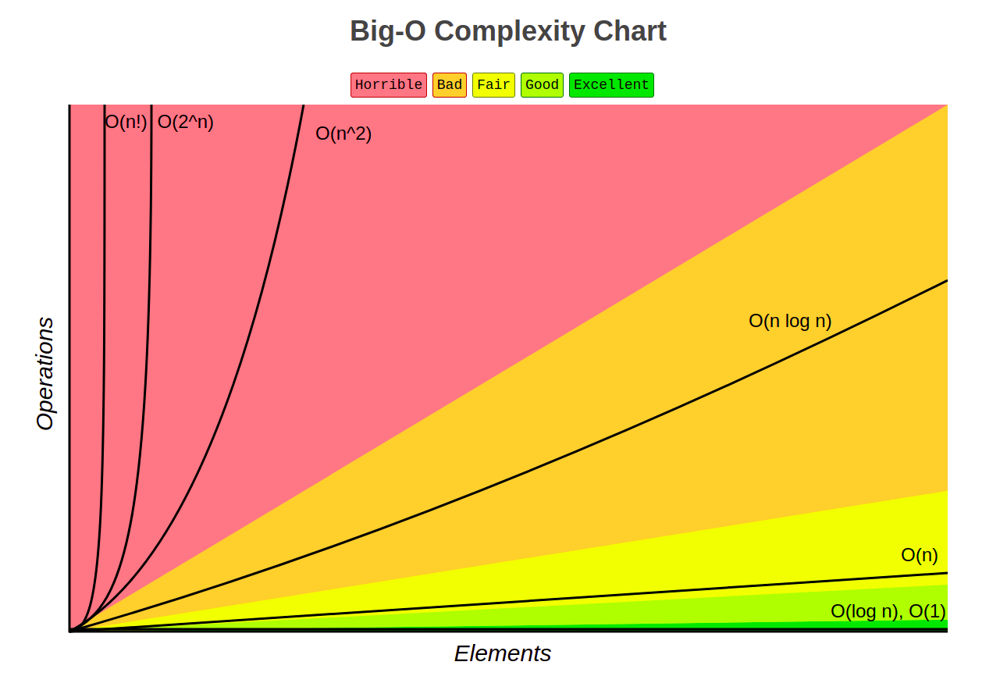
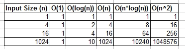

# Big O Notation

- In layman terms what is log(n) complexity ? does it always comes when divide and conquer strategy is used
    - A logarithmic function is the opposite of an exponential function. When you say something grows exponentially, it’s being multiplied. When something grows logarithmically, it is being divided.
    - So from this explanation, when we see log_2(n), it means, divide and conquer strategy is being used. i.e the long sequence is divided into half every iteration based on some logic/condition in a recursive manner and the results are grouped as we roll back after reaching the smallest unit
- https://stackoverflow.com/questions/2307283/what-does-olog-n-mean-exactly
  