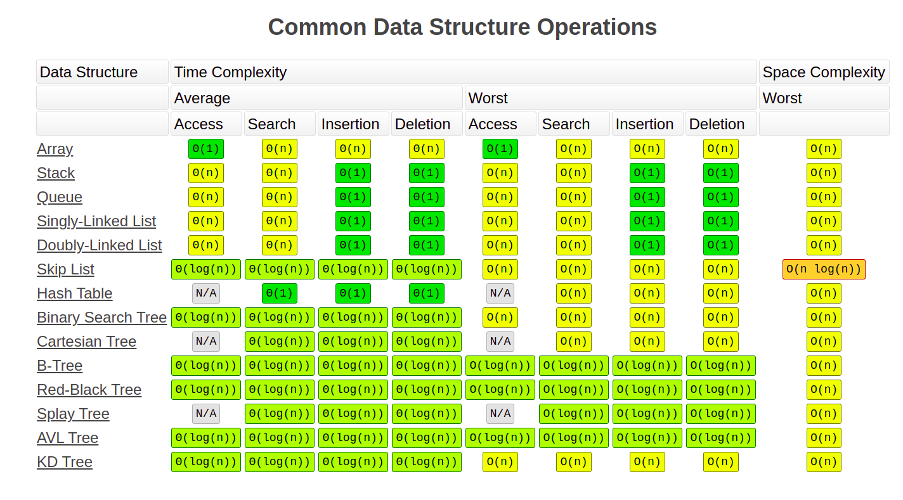

# Data Structures
- Array
- Stack
- Trees
    - Binary Tree
    - Binary Search Tree
    - The AVL trees are more balanced compared to Red-Black Trees, but they may cause more rotations during insertion 
      and deletion. So if your application involves frequent insertions and deletions, then Red-Black trees should be 
      preferred. And if the insertions and deletions are less frequent and search is a more frequent operation, then AVL 
      tree should be preferred over Red-Black Tree.
    - A four-level tree of 4 KB pages with a branching factor of 500 can store up to 256 TB.  
- Linked List
  - https://www.codefellows.org/blog/implementing-a-singly-linked-list-in-python/
- Queue
- Hash Table
    - https://stackoverflow.com/questions/327311/how-are-pythons-built-in-dictionaries-implemented
- Graph
- [Python DS](https://realpython.com/python-data-structures/)

  
