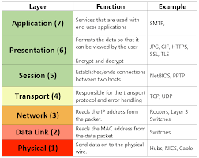
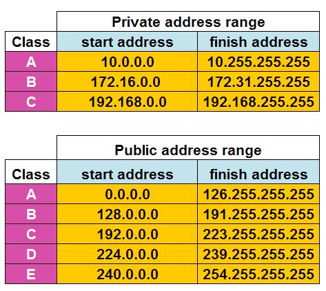

OSI
---

7 - Away - Application - HTTP, SMPT  
6 - Pizza - Presentation - WMV, JPEG, MOV   
5 - Sausage - Session -   
4 - Throw - Transport - TCP/UDP  
3 - Not - Networking - IP Address, Routing   
2 - Do - Data - Switching, MAC   
1 - Please - Physical - Data,  Cable, Cat6   

Subnet 
------

255.255.255.0 / 24
Always subtract 2 from host total : Network ID first address and Broadcast last address

ipaddressguide.com/cidr