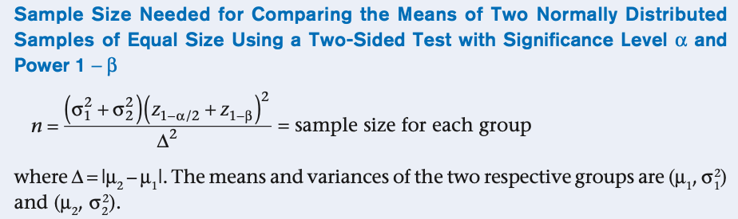

# AB Testing
- - [A/B testing](https://www.analyticsvidhya.com/blog/2020/10/ab-testing-data-science/)
- https://www.interviewquery.com/course/data-science-course/lessons/statistics-and-ab-testing

H0 -> The new feature doesn't give improved performance for our application i.e both the population acts the same
H1 -> States otherwise

Ho : p >= 0.05
H1 : p < 0.05

- Choose and characterize metrics to evaluate your experiments. What do you care about? How do you want to measure the effect?
    - There are four categories of evaluation metrics that we should use:
        - Aggregations -> Sums and Counts
        - Distributions -> Mean and median or different percentiles
        - Percentages -> Click through rate, percentage of users that did X action, etc…
        - Ratios -> Any two metrics divided by each other
  
- Choose the significance level, power, the length of the test, and calculate the required sample size.

- Implement the A/B test with control/treatment groups and run the test.

- Analyze the results and draw valid conclusions
