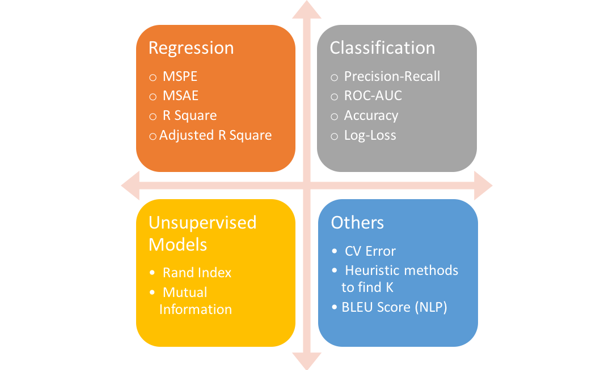

# Machine Learning

- **Problem**: Dive in with the interviewer and explore what the problem is. 
  Look for edge cases or simple and high-impact parts of the problem that you might be 
  able to close out quickly.
- **Metrics**: Once you have determined the scope and parameters of the problem you’re 
  trying to solve, figure out how you will measure success. Focus on what is important 
  to the business and not just what is easy to measure.
- **Data**: Figure out what data is available to solve the problem. 
  The interviewer might give you a couple of examples, but ask about additional 
  information sources. If you know of some public data that might be useful, bring 
  it up here too.
- **Labels and Features**: Using the data sources you discussed, what features would you 
  build? If you are attacking a supervised classification problem, how would you generate 
  labels? How would you see if they were useful?
- **Model**: Now that you have a metric, data, features, and labels, what model is a good 
  fit? Why? How would you train it? What do you need to watch out for?
- **Validation**: How would you make sure your model works offline? What data would you 
  hold out to test your model works as expected? What metrics would you measure?
- **Deployment** and Monitoring: Having developed a model you are comfortable with, 
  how would you deploy it? Does it need to be real-time or is it sufficient to batch 
  inputs and periodically run the model? How would you check performance in production? 
  How would you monitor for model drift where its performance changes over time?

- What is joint probability?
  
- What’s the difference between a generative and discriminative model?
    - Input data : X and its lables Y
    - https://stackoverflow.com/questions/879432/what-is-the-difference-between-a-generative-and-a-discriminative-algorithm
    - Generative : Learns join probability P(X,Y)
    - Discriminative: Learns conditional probability P(Y|X)
    - Discriminative models generally outperform generative models in classification tasks.

- What’s the trade-off between bias and variance?
    - Bias error is due to assumptions and leads to under fitting 
    - Variance error is due to model complexicity
  
- How is KNN different from k-means clustering?
    - kNN- supervised
    - kMeans - Clusterinf algo

- https://medium.com/analytics-vidhya/preparing-for-interview-on-machine-learning-3145caeea06b

- Classification Evaluation Metric
    - https://www.kaggle.com/ishivinal/machine-learning-model-evaluation-metrics
    - Accuracy
    - Precision `TP / (TP + FP)` classifiers exactness
    - Recall TPR `TP / (TP + FN)` classifiers completeness; low values means many FN 
    - F1 Score : `2 . (P * R) / (P + R)` [0,1] [Worst, Best] Used where TN are no use
    - AUC - ROC Curve : TPR vs FPR
    - Logistic Loss
- Regression Evaluation Metric
    - MAE : Finds median in the data, Robust to outliers, not diffeentiable
    - MSE: Is finding mean, differentiable
    - RMSE
    - MSLogError
    - RMSLogError
- Cross Validation
    - KFold : k= 5 or 10
    - StritifiedKFold
    - LOOCV
 

     One important distinction between MAE & RMSE is that minimizing 
     the squared error over a set of numbers results in finding its mean, and minimizing the absolute 
     error results in finding its median. This is the reason why MAE is robust to outliers whereas 
     RMSE is not. This answer explains this concept in detail.
    - https://www.quora.com/How-would-a-model-change-if-we-minimized-absolute-error-instead-of-squared-error-What-about-the-other-way-around
    - https://medium.com/usf-msds/choosing-the-right-metric-for-evaluating-machine-learning-models-part-2-86d5649a5428
    - https://elvissaravia.substack.com/p/10-must-read-ml-blog-posts

- What’s the difference between Type I and Type II error?
    - FP Type I Man is preganant
    - FN Type II Female is not carrying baby when she is
    
- What Is Gradient Descent?
    - Optimization algorithms good for convex functions
    
- What Is Bagging and Boosting?
    Bagging: Same model, parallel trianing
    Boosting: Same model, sequential trianing

- What is Bayes’ Theorem? How is it useful in a machine learning context?
    - posterior probability given prior probability
    - https://betterexplained.com/articles/an-intuitive-and-short-explanation-of-bayes-theorem/
    
- Why is “Naive” Bayes naive?
    - Assumes the features are independent to each other
    
- Explain the difference between L1 and L2 regularization.
    - Lasso L1 : `|Y- Y`|` assigns 0 or 1 to weights; sparse data; feature selection; robust to outliers
    - Rigid L2 : `(Y - Y)^2` ; non sparse outputs; shrinks all coefficients by the same proportion
    
- What’s a Fourier transform?
    - https://betterexplained.com/articles/an-interactive-guide-to-the-fourier-transform/
    - Find the recipe for given smoothie
    
- What’s the difference between probability and likelihood?
    - https://stats.stackexchange.com/questions/2641/what-is-the-difference-between-likelihood-and-probability#2647
    - Likelihood is conditioned on observed data and it is a function of unknown parameters θ
        `L(θ|O)=P(O|θ)`
      
- What cross-validation technique would you use on a time series dataset?
    - forward chaining where you’ll be able to model on past data then look at forward-facing data.
        Fold 1 : training [1], test [2]   
        Fold 2 : training [1 2], test [3]   
        Fold 3 : training [1 2 3], test [4]   
        Fold 4 : training [1 2 3 4], test [5]   
        Fold 5 : training [1 2 3 4 5], test [6]   
      
- How is a decision tree pruned?
    - Top down
    - Bottom up
    - Remove node until its not affecting th accuracy

- How would you handle an imbalanced dataset?
    - Collect more data? 
    - Resample data : Over sampling minority classes, Under sampling majority classes
    - Change metrics : Accuracy vs F1 / ROC
    - Stratified sampling
    - Synthetic samples : SMOTE or the Synthetic Minority Over-sampling Technique.
    
- What’s the “kernel trick” and how is it useful?
    - Mapping higher dimension data to lower dimension 
    
- How do you handle missing or corrupted data in a dataset?
    - Drop
    - Use median or mean when less outliers
    
    